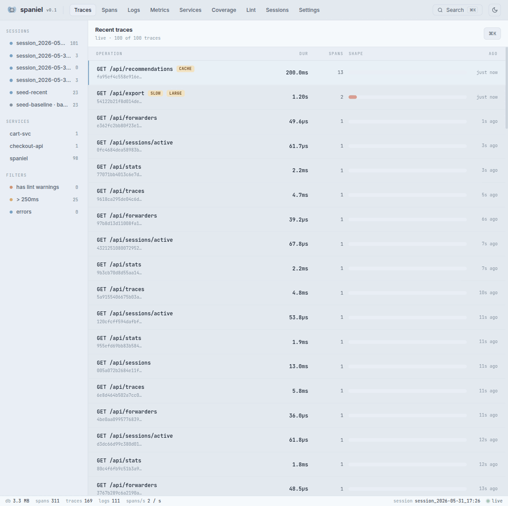

<div align="center">

<svg xmlns="http://www.w3.org/2000/svg" viewBox="0 0 420 160" width="420" height="160">
  <!-- Dog body -->
  <ellipse cx="210" cy="105" rx="52" ry="34" fill="#c8a97e"/>
  <!-- Head -->
  <circle cx="252" cy="80" r="28" fill="#c8a97e"/>
  <!-- Snout -->
  <ellipse cx="270" cy="88" rx="14" ry="10" fill="#b8926a"/>
  <!-- Nose -->
  <ellipse cx="275" cy="84" rx="5" ry="4" fill="#2d1a0e"/>
  <!-- Eye -->
  <circle cx="258" cy="75" r="5" fill="#1a0a00"/>
  <circle cx="259.5" cy="73.5" r="1.5" fill="white"/>
  <!-- Left floppy ear -->
  <ellipse cx="232" cy="68" rx="12" ry="20" fill="#a07850" transform="rotate(-18 232 68)"/>
  <!-- Right floppy ear -->
  <ellipse cx="270" cy="63" rx="10" ry="18" fill="#a07850" transform="rotate(15 270 63)"/>
  <!-- Tail -->
  <path d="M162 95 Q140 60 155 45" stroke="#c8a97e" stroke-width="10" fill="none" stroke-linecap="round"/>
  <!-- Front legs -->
  <rect x="215" y="130" width="12" height="22" rx="6" fill="#c8a97e"/>
  <rect x="235" y="132" width="12" height="20" rx="6" fill="#c8a97e"/>
  <!-- Back legs -->
  <rect x="175" y="128" width="12" height="22" rx="6" fill="#b8926a"/>
  <rect x="193" y="130" width="12" height="20" rx="6" fill="#b8926a"/>
  <!-- Trace waterfall bars -->
  <rect x="30" y="22" width="90" height="10" rx="5" fill="#6ee7b7" opacity="0.9"/>
  <text x="30" y="19" font-family="monospace" font-size="8" fill="#6ee7b7" opacity="0.85">api</text>
  <rect x="50" y="38" width="55" height="10" rx="5" fill="#67e8f9" opacity="0.9"/>
  <text x="50" y="35" font-family="monospace" font-size="8" fill="#67e8f9" opacity="0.85">postgres</text>
  <rect x="65" y="54" width="28" height="10" rx="5" fill="#a78bfa" opacity="0.9"/>
  <text x="65" y="51" font-family="monospace" font-size="8" fill="#a78bfa" opacity="0.85">redis</text>
  <line x1="45" y1="32" x2="50" y2="38" stroke="#6ee7b7" stroke-width="1" opacity="0.4"/>
  <line x1="60" y1="48" x2="65" y2="54" stroke="#67e8f9" stroke-width="1" opacity="0.4"/>
</svg>

# spaniel

**Local OpenTelemetry viewer. Postman for your traces.**

[](LICENSE)
[](https://go.dev)
[](https://opentelemetry.io)

</div>

---

You run `docker compose up`. You hit an endpoint. It takes 800ms. You have no idea if it's Postgres, Redis, an N+1 query, or the downstream HTTP call. So you add `print()` statements. There has to be a better way.

**spaniel** is a single binary that receives OpenTelemetry traces, logs, and metrics from your local services and shows them in a beautiful UI — with automatic N+1 detection, a semantic convention linter, and session diffing so you can see exactly what your code change made better or worse.

No Docker required. No cloud account. Nothing leaves your machine.



---

## Install

```bash
# macOS / Linux
brew install zfogg/tap/spaniel

# Go
go install github.com/zfogg/spaniel/cmd/spaniel@latest

# Docker
docker run -p 8080:8080 -p 4317:4317 -p 4318:4318 ghcr.io/zfogg/spaniel:latest
```

## Quickstart

**1. Start spaniel** (browser opens automatically)

```bash
spaniel
```

**2. Point your app at it**

```bash
export OTEL_EXPORTER_OTLP_ENDPOINT=http://localhost:4318
export OTEL_EXPORTER_OTLP_PROTOCOL=http/protobuf
```

**3. Hit an endpoint. Traces appear live.**

That's it. No config files, no API keys, no YAML pipelines.

### Even faster: `spaniel run`

Don't want to export env vars or start the server separately? Wrap any
OpenTelemetry-instrumented command — spaniel boots itself if it isn't already
running, injects the OTLP endpoint, runs your process in a fresh session, and
prints a trace summary when it exits:

```bash
spaniel run -- pytest tests/integration/
spaniel run -- npm test
spaniel run -- ./my-server
```

Use `spaniel record -- <cmd>` to also mark the run as a baseline and pop open
the diff view when it finishes.

---

## Features

### 🔍 Trace waterfall & flame graph

Click any trace to see a full waterfall view with parent-child span relationships, duration bars, and service color-coding. Toggle to flame graph mode to spot hot paths instantly. Click any span to inspect its attributes as a structured tree.

### ⚡ Automatic N+1 detection

spaniel fingerprints your DB spans and flags when the same query is called an excessive number of times within a single trace. It surfaces the offending parent span, the total wasted time, and the exact statement — without you having to count anything.

```
⚠ N+1 detected in GET /api/projects
  SELECT * FROM builds WHERE project_id = ? — called 47 times (220ms wasted)
  Likely origin: ProjectController.list [span_id: a3f2...]
```

### 🧹 Semantic convention linter

As spans arrive, spaniel validates them against the [OpenTelemetry Semantic Conventions](https://opentelemetry.io/docs/specs/semconv/) spec and flags violations in real time. Missing `db.system` on a database span? Wrong attribute name on an HTTP span? spaniel catches it before you ship.

```
12 spans with warnings this session:
  [error]  3 DB spans missing required attribute: db.system
  [warn]   8 spans with service.name = "unknown_service" — configure OTEL_SERVICE_NAME
  [warn]   1 span with zero duration — likely an instrumentation bug
```

### 🔀 Session diff

Mark any point in time as a baseline. Make your code change. Run again. spaniel diffs the two sessions and shows exactly what changed: new spans, removed spans, duration deltas per operation, attribute changes.

```
Session diff: "before refactor" → "after refactor"
  ✓ GET /api/builds        −18% faster  (820ms → 672ms)
  ✓ SELECT builds          −52% fewer calls  (47 → 3)
  △ POST /api/webhooks     +4% slower  (within noise)
```

```bash
spaniel session new "before refactor"
# ... make your change ...
spaniel session new "after refactor"
# open the diff view in the browser
```

### 🗺 Auto-generated service map

No config. spaniel builds a live dependency graph from your span data — which services are calling which, with call counts, average latency, and error rates on each edge.

### 📋 Log correlation

Full log viewer with severity filtering and free-text search. If a log has a `trace_id`, click it to jump directly to that trace in the waterfall. From any span, see the logs emitted during its execution window.

### 📈 Metrics with trace exemplars

spaniel ingests OTLP metrics too — gauges, counters, and histograms — and charts them with p50/p95/p99 percentile bands. When a metric point carries an exemplar, click it to jump straight to the trace that produced the outlier.

### 🎯 Instrumentation coverage

See which of your HTTP routes have ever been traced. Point spaniel at an OpenAPI/proto spec with `--routes-file` and it computes a coverage percentage and lists the **dark routes** — endpoints in your spec that no trace has ever exercised.

### ⌨️ Works in the terminal too

Not everything needs a browser. spaniel ships a full set of TUI commands for the keyboard-first:

```bash
spaniel tui              # all-in-one dashboard: spans + logs + issues, live
spaniel watch            # live span/issue ticker (table on a TTY, line-stream in a pipe)
spaniel logs tail        # follow logs with severity/service/trace filters
spaniel trace <id>       # open an interactive waterfall for one trace
```

On a pipe these stream plain lines, so they compose with `grep`, `jq`, and friends.

### 📡 OTLP proxy mode

Already sending traces to Grafana Tempo or Datadog? Run spaniel as a transparent proxy — it stores locally and forwards to your upstream simultaneously. Zero changes to your existing OTel pipeline.

```bash
spaniel --forward http://tempo:4318
```

### 🤖 MCP server for AI agents

Spaniel speaks [MCP](https://modelcontextprotocol.io) over a streamable-HTTP endpoint at `/mcp`, so a coding agent (Claude Code / Desktop) can read the traces it just generated — find the slow span, see the detected N+1, diff against a baseline — and fix the code, no screenshots required. Includes a read-only `query_sql` escape hatch for ad-hoc DuckDB queries. See [MCP server](#mcp-server).

---

## How it works

spaniel is a single self-contained binary. No external services, no sidecar processes.

- **OTLP receiver** — accepts traces/logs/metrics over gRPC (`:4317`) and HTTP (`:4318`)
- **DuckDB** — stores everything locally in `~/.spaniel/spaniel.duckdb`; persists across restarts
- **Ingestion pipeline** — normalizes, lints, runs detectors, publishes live updates via WebSocket
- **Embedded React UI** — served from the binary itself; opens in your browser at `http://localhost:8080`

```
your app  ──OTLP──►  spaniel :4317/:4318
                         │
                      DuckDB  (~/.spaniel/)
                         │
                    React UI  :8080
```

Data retention defaults to 7 days and 500 MB; old sessions are pruned automatically. Configure with `~/.spaniel/config.yaml` or flags.

A few things for the paranoid and the high-volume:

- **Local-only by default**, but you can require a bearer token (`--bearer-token`, or `SPANIEL_BEARER_TOKEN`) and serve over TLS (`--tls-cert` / `--tls-key`) if you expose it on a network.
- **Back-pressure built in** — optional per-source rate limiting (`--source-rps`) and sampling (`--sample-rate`) keep a chatty service from filling your disk, while always keeping errors, N+1s, and slow traces.

---

## MCP server

Spaniel serves a [Model Context Protocol](https://modelcontextprotocol.io) endpoint at `http://localhost:8080/mcp` (streamable HTTP, enabled by default). It lets an AI agent query everything Spaniel knows about your run.

Add it to **Claude Code**:

```bash
claude mcp add --transport http spaniel http://localhost:8080/mcp
```

Or commit a project-scoped `.mcp.json` to your repo so collaborators get it automatically:

```json
{
  "mcpServers": {
    "spaniel": {
      "type": "http",
      "url": "http://localhost:8080/mcp"
    }
  }
}
```

For **Claude Desktop** (or any client without native HTTP MCP support), bridge with [`mcp-remote`](https://www.npmjs.com/package/mcp-remote):

```json
{
  "mcpServers": {
    "spaniel": {
      "command": "npx",
      "args": ["-y", "mcp-remote", "http://localhost:8080/mcp"]
    }
  }
}
```

> The Settings page (⚙️ → **MCP**) shows the endpoint and has copy buttons for both the command and the `.mcp.json` above.

### Tools

All tools are **read-only** unless you start spaniel with `--mcp-allow-writes`.

| Tool | What it does |
|------|--------------|
| `get_server_info` | version + how much data is stored |
| `list_traces` / `get_trace` | recent traces; full waterfall + issues + correlated logs + lint for one trace |
| `get_span` / `list_slow_spans` | one span's detail; the slowest spans in a session |
| `list_issues` / `list_lint_warnings` | detected N+1/error-chain/etc.; semconv violations |
| `query_logs` / `search` | logs by trace/span/service/severity; full-text + `lint:` search |
| `get_service_map` / `list_services` / `get_stats` | dependency graph; services; counts |
| `get_metrics` / `get_metric_series` | metric catalog and time series |
| `list_sessions` / `diff_sessions` | sessions; before/after comparison |
| `query_sql` | **read-only** raw SQL over the DuckDB tables (engine-enforced) |
| `create_session` / `activate_session` / `set_baseline` / `prune_data` | **write** — only registered with `--mcp-allow-writes` |

It also exposes **resources** (`spaniel://schema`, `spaniel://guide`) and **prompts** (`debug_latest_trace`, `diff_against_baseline`, `find_bottlenecks`).

Config: `mcp_enabled` (default `true`), `mcp_allow_writes` (default `false`), or the `--mcp-enabled` / `--mcp-allow-writes` flags.

---

## CI integration

Run spaniel in GitHub Actions to catch regressions before they merge.

```yaml
- name: Start spaniel
  run: spaniel --no-browser &

- name: Run integration tests
  run: pytest tests/integration/   # send OTLP to http://localhost:4318

- name: Check for regressions
  run: spaniel ci check --baseline ./spaniel-baseline.json --threshold 20
```

Commit `spaniel-baseline.json` to your repo. `spaniel ci check` exits non-zero (failing the build) when p95 / root-duration regresses past `--threshold` percent, or when a fingerprint repeats more than `--n1-threshold` extra times — i.e. a new or worse N+1.

Generate the baseline once from a known-good run and commit it; regenerate it after intentional changes:

```bash
spaniel ci export --output ./spaniel-baseline.json
```

> **Tip:** `spaniel run -- <your test command>` does the boot-server + fresh-session dance in one step, which is often cleaner than backgrounding the server yourself.

---

## Configuration

```yaml
# ~/.spaniel/config.yaml
port: 8080
db_path: ~/.spaniel/spaniel.duckdb
retention_days: 7
max_sessions: 50
max_db_size_mb: 500
no_browser: false
mcp_enabled: true        # serve the MCP endpoint at /mcp
mcp_allow_writes: false  # let MCP clients mutate state (sessions, prune)
forward:
  - http://tempo:4318
  - http://otelcollector:4318
```

Settings resolve **highest priority first**:

1. **CLI flags** (`--port`, `--forward`, …)
2. **`SPANIEL_*` environment variables** (e.g. `SPANIEL_PORT`, `SPANIEL_DB_PATH`, `SPANIEL_BEARER_TOKEN`)
3. **Project `.spaniel.yaml`** in your repo root — commit per-project defaults
4. **Global `~/.spaniel/config.yaml`**
5. Built-in defaults

`spaniel config` prints the effective, fully-resolved config; `spaniel config path` shows which file is active; `spaniel config set <key> <value>` edits the global file.

---

## CLI reference

**Server**
```
spaniel                              start the server + UI (opens browser)
spaniel --no-browser                 ... without opening a browser (CI/servers)
spaniel --forward <url>              also forward OTLP upstream (repeatable)
spaniel --mcp-allow-writes           let MCP clients mutate state (off by default)
```

**Sessions**
```
spaniel session new [label]          create and activate a new session
spaniel session list                 interactive picker (activate / baseline / delete)
spaniel session activate <id|label>  switch the active session
spaniel session baseline [id|label]  toggle a session's diff-baseline flag
spaniel session delete <id|label>    delete a session
spaniel import <name> <file>         import OTLP/Jaeger JSON as a baseline session
                                     (use '-' to read from stdin)
```

**Diff & CI**
```
spaniel diff -b <a> -c <b>           diff two sessions (TUI, or --json for piping)
spaniel ci export -o <file>          export the active session as a baseline JSON
spaniel ci check -b <file>           compare active session vs baseline; exit 1 on regression
```

**Run instrumented commands**
```
spaniel run -- <cmd> [args...]       run a command wired to spaniel, print a trace summary
spaniel record -- <cmd> [args...]    same, but save as a baseline and open the diff view
```

**Terminal viewers**
```
spaniel tui                          all-in-one live dashboard
spaniel watch                        live span/issue ticker
spaniel logs tail                    follow logs (--service / --trace / --severity filters)
spaniel trace <id|short-id>          interactive waterfall for one trace
```

**Maintenance**
```
spaniel config [show|path|set]       show / locate / edit configuration
spaniel doctor                       diagnose ports, DB, config, embed, upstreams
spaniel prune                        apply the retention policy now
spaniel compact                      CHECKPOINT + VACUUM the database
spaniel reset --yes                  wipe all data and start fresh
```

Run `spaniel <command> --help` for the full flag list on any command.

---

## Docker Compose

Drop spaniel into your existing `docker-compose.yml`:

```yaml
services:
  spaniel:
    image: ghcr.io/zfogg/spaniel:latest
    ports:
      - "8080:8080"
      - "4317:4317"
      - "4318:4318"
    volumes:
      - spaniel-data:/data
    environment:
      - SPANIEL_DB_PATH=/data/spaniel.duckdb

  your-api:
    # ... your existing service ...
    environment:
      - OTEL_EXPORTER_OTLP_ENDPOINT=http://spaniel:4318
      - OTEL_EXPORTER_OTLP_PROTOCOL=http/protobuf
      - OTEL_SERVICE_NAME=your-api

volumes:
  spaniel-data:
```

One engineer adds this. The whole team gets local observability. No individual setup required.

---

## Why not Grafana / Jaeger / Datadog?

| | spaniel | Grafana LGTM | Jaeger | Datadog |
|---|---|---|---|---|
| Single binary | ✓ | ✗ (4+ containers) | ✗ | ✗ |
| Zero config | ✓ | ✗ | ✗ | ✗ |
| N+1 detection | ✓ | ✗ | ✗ | paid |
| Semconv linter | ✓ | ✗ | ✗ | ✗ |
| Session diff | ✓ | ✗ | ✗ | ✗ |
| Local only / private | ✓ | ✓ | ✓ | ✗ |
| Cost | free | free | free | expensive |

spaniel is specifically built for the **local development loop**, not production monitoring. Use it on your laptop. Use Grafana or Datadog in prod.

---

## Roadmap

- [x] OTLP receiver (gRPC + HTTP) — traces, logs, **and metrics**
- [x] DuckDB storage with automatic retention
- [x] Trace waterfall + flame graph
- [x] N+1 query detection
- [x] Semantic convention linter
- [x] Session diff
- [x] Service map
- [x] Log correlation
- [x] Metrics with trace exemplars
- [x] OTLP proxy mode
- [x] Baseline import from OTLP / Jaeger JSON (`spaniel import`)
- [x] Instrumentation coverage (`--routes-file`)
- [x] CI regression detection (`spaniel ci`)
- [x] Terminal UI (`spaniel tui` / `watch` / `logs tail`)
- [ ] Live import from a running Tempo / Jaeger backend
- [ ] More detectors (connection-pool exhaustion, retry storms)
- [ ] Cloud baseline sync (team feature)

---

## Contributing

```bash
git clone https://github.com/zfogg/spaniel
cd spaniel
make setup    # point git at the repo's pre-commit hooks (one-time)
make dev      # Go backend + Vite dev server with hot reload
make build    # production binary with the frontend embedded via go:embed
make test     # Go test suite
```

Frontend tests live in `frontend/`:

```bash
cd frontend
pnpm test     # vitest unit tests
pnpm e2e      # Playwright end-to-end tests
```

Issues and PRs welcome.

---

## License

MIT © [Zachary Fogg](https://github.com/zfogg)
